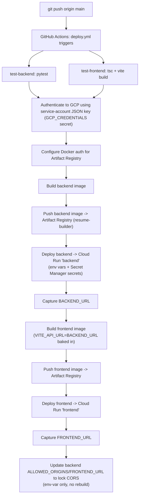

# CI/CD — Automatic GitHub -> Cloud Run Deployment

Replaces the manual flow (local VS Code -> Cloud Shell Editor -> manual
`docker build` -> manual `gcloud run deploy`) with one pipeline:
`.github/workflows/deploy.yml`. Every push to `main` builds, pushes, and
deploys **both** services automatically. Nothing manual remains except the
one-time setup below.

```
git add .
git commit -m "..."
git push origin main
```
is the entire deploy process once setup is complete.

## Authentication

This pipeline authenticates to Google Cloud using a **service-account JSON
key**, stored as the `GCP_CREDENTIALS` GitHub repository secret, passed to
`google-github-actions/auth`'s `credentials_json` input.

## Deployment flow



## Project specifics this pipeline is wired to

| Item | Value |
|---|---|
| GitHub repo | `likhitha-lab/resume-management-system` |
| GCP project | `developer-project-likhitha` |
| Region | `asia-south1` |
| Artifact Registry repo | `resume-builder` |
| Database | Neon PostgreSQL (external, not GCP-hosted) |
| File storage | Google Cloud Storage, bucket `resume_bucket08` |
| Cloud Run services | `backend`, `frontend` |

## One-time setup (you run these, once)

Requires `gcloud` installed and authenticated as a user with IAM-admin
rights on the project (`gcloud auth login`, `gcloud config set project
developer-project-likhitha`).

1. **Provision/validate APIs, Artifact Registry, both service accounts, and
   IAM roles:**
   ```bash
   bash scripts/setup-gcp-cicd.sh
   ```
   This does *not* create a JSON key — that's the next step, deliberately
   manual.

2. **Generate the deploy service account's JSON key and add it to GitHub:**
   ```bash
   gcloud iam service-accounts keys create github-deployer-key.json \
     --iam-account=github-deployer@developer-project-likhitha.iam.gserviceaccount.com
   ```
   Then:
   - Open the repo on GitHub -> **Settings -> Secrets and variables ->
     Actions -> New repository secret**.
   - Name: `GCP_CREDENTIALS`.
   - Value: the **entire contents** of `github-deployer-key.json` (paste
     the whole JSON object, not a path).
   - Save.
   - **Delete `github-deployer-key.json` from local disk immediately**
     (`rm github-deployer-key.json`) — once it's in GitHub Secrets, no
     local copy should remain. `.gitignore`'s `*.json` rule stops it from
     ever being committed, but that's not a substitute for deleting it —
     an uncommitted key file sitting on disk is still a live credential.
   - Treat this key like a password: it does not expire on its own. Rotate
     it periodically (`gcloud iam service-accounts keys create` a new one,
     update the GitHub secret, then `gcloud iam service-accounts keys
     delete <old-key-id> --iam-account=...` on the old one) and immediately
     if it's ever exposed (committed, pasted somewhere, shared over an
     insecure channel).

3. **Create the app's real secrets in Secret Manager** (Gemini key, DB URL,
   JWT key, admin password — never in GitHub, never in the image):
   ```bash
   export GEMINI_API_KEY="<your real Gemini key>"
   export DATABASE_URL="postgresql+psycopg://<user>:<password>@<your-neon-host>/<db>?sslmode=require"
   bash scripts/setup-gcp-secrets.sh
   ```
   `DATABASE_URL` is your **Neon PostgreSQL** connection string — get it
   from the Neon console's connection details. No GCP-managed database
   instance, connector, or proxy socket is involved anywhere in this
   pipeline; Neon is a fully external, GCP-independent Postgres. If you
   don't yet have a GCS bucket for file storage, see `DEPLOYMENT_GCP.md`
   §11.

4. **Add the remaining GitHub repository secrets** (same Settings page as
   step 2):

   | Secret | Value | Sensitive? |
   |---|---|---|
   | `GCP_CREDENTIALS` | full JSON contents from step 2 | **yes — a real credential, guard it accordingly** |
   | `GCP_RUNTIME_SERVICE_ACCOUNT` | `resume-builder-runtime@developer-project-likhitha.iam.gserviceaccount.com` | identifier, not a credential |
   | `GCS_BUCKET_NAME` | `resume_bucket08` | identifier |

   The application's own secrets (JWT key, Gemini key, DB password/Neon
   connection string) live only in Secret Manager (step 3), referenced by
   name in `deploy.yml`'s `--set-secrets` flag, never duplicated into
   GitHub.

5. **Push to `main`.** The workflow runs automatically from here on.

## IAM roles granted (by `setup-gcp-cicd.sh`)

| Role | Bound to | Why |
|---|---|---|
| `roles/run.admin` | deploy SA (`github-deployer@...`) | create/update Cloud Run services and revisions |
| `roles/artifactregistry.writer` | deploy SA | push built images |
| `roles/iam.serviceAccountUser` | deploy SA | deploy a revision that *runs as* the runtime SA |
| `roles/storage.objectAdmin` | runtime SA (`resume-builder-runtime@...`) | app reads/writes resume files in GCS |
| `roles/secretmanager.secretAccessor` | runtime SA | Cloud Run resolves `--set-secrets` at container start |

No database-specific IAM role is needed — the database is Neon
PostgreSQL, external to GCP, reached over its own connection string (from
Secret Manager) rather than a GCP-managed proxy/socket.

Neither service account is ever granted `Owner`/`Editor` — each is scoped
to exactly what it needs. These roles govern what the deploy SA is
*allowed to do* once authenticated, independent of how it authenticates.

## Environment variables — what goes where

Full authoritative list is `backend/app/core/config.py`. Split by how each
one reaches the running container:

| Variable | Where it's set | Why |
|---|---|---|
| `GEMINI_MODEL`, `STORAGE_BACKEND`, `GCS_BUCKET_NAME`, `GOOGLE_CLOUD_PROJECT`, `ALLOWED_ORIGINS`, `FRONTEND_URL`, `BACKEND_URL` | Cloud Run env vars, set by `deploy.yml`'s `--set-env-vars`/`--update-env-vars` | not secret — safe as plain env vars |
| `GEMINI_API_KEY`, `JWT_SECRET_KEY`, `DATABASE_URL`, `DEFAULT_ADMIN_PASSWORD` | Secret Manager, resolved via `deploy.yml`'s `--set-secrets` | genuinely sensitive — never appear in `gcloud` output, Cloud Run config, or GitHub in plaintext |
| `VITE_API_URL` | Docker build `ARG` in `frontend/Dockerfile`, supplied by `deploy.yml` at build time | Vite inlines `VITE_`-prefixed vars into the built JS at *build* time, not read at container runtime — can't be a normal Cloud Run env var |
| Everything else in `config.py` (rate limits, token lifetimes, pool sizes, etc.) | left at their code defaults | no secret, no per-environment value needed |

Nothing here is copied from a local `.env` file into GitHub or the image —
every value above is either a plain deploy-time env var or a Secret
Manager reference by name.

## Manual steps you still have to complete

These cannot be automated from this repo — they need your own GCP/GitHub
account access:

1. Run `scripts/setup-gcp-cicd.sh` once (needs your `gcloud` login).
2. Generate the deploy SA's JSON key and add it as the `GCP_CREDENTIALS`
   GitHub secret (step 2 above) — deliberately manual, not scripted.
3. Run `scripts/setup-gcp-secrets.sh` once, with your real `GEMINI_API_KEY`
   and `DATABASE_URL` (your Neon PostgreSQL connection string — no GCP-side
   database to create first).
4. Create the GCS bucket if you don't have one yet (`DEPLOYMENT_GCP.md` §11)
   — this deployment expects `resume_bucket08`.
5. Add the remaining 2 GitHub repository secrets listed above.
6. **If `backend/.env` or `frontend/.env` were ever committed to this repo
   before today**, adding them to `.gitignore` now does *not* remove them
   from git history. Check with `git log --all --full-history -- backend/.env
   frontend/.env`; if any commits show up, treat every value in those files
   as leaked — rotate the Gemini key, JWT secret, and DB password, and
   scrub history (`git filter-repo` or BFG) before making the repo public
   or handing access to anyone else. The same applies to the JSON key file
   if it's ever accidentally committed — rotate it immediately (see step 2's
   rotation note) and scrub history the same way.
7. First push after setup: watch the Actions tab — if `test-backend` or
   `test-frontend` fails, deploy never runs (by design). If deploy fails on
   the auth step, it's almost always `GCP_CREDENTIALS` missing or not valid
   JSON. If it fails on `gcloud run deploy` or the app can't reach the
   database at runtime, check the four Secret Manager entries next —
   especially `database-url` (a bad/expired Neon connection string is the
   most likely cause, since there's no managed proxy in between to mask
   connectivity issues) — see `DEPLOYMENT_GCP.md` §15's troubleshooting note.

## Files involved

| File | Role |
|---|---|
| `.github/workflows/deploy.yml` | the pipeline itself |
| `scripts/setup-gcp-cicd.sh` | one-time API/Artifact Registry/service account/IAM provisioning (does not generate the JSON key) |
| `scripts/setup-gcp-secrets.sh` | one-time Secret Manager provisioning |
| `.gitignore` (root, `backend/`, `frontend/`) | ensures no `.env` file, and no `*.json` key file, is ever committed |
| `DEPLOYMENT_GCP.md` | full manual runbook this pipeline automates (GCS bucket creation, security checklist, verification commands) — still the reference for anything `deploy.yml` doesn't cover |
